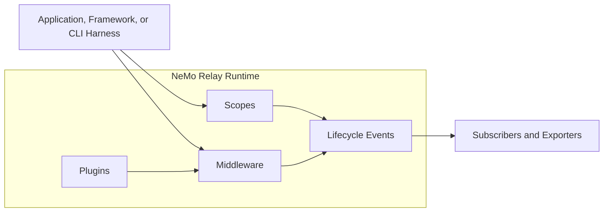

<!--
SPDX-FileCopyrightText: Copyright (c) 2026, NVIDIA CORPORATION & AFFILIATES. All rights reserved.
SPDX-License-Identifier: Apache-2.0
-->

[](https://github.com/NVIDIA/NeMo-Relay/blob/main/LICENSE)
[](https://github.com/NVIDIA/NeMo-Relay/)
[](https://github.com/NVIDIA/NeMo-Relay/releases)
[](https://app.codecov.io/gh/NVIDIA/NeMo-Relay)
[](https://pypi.org/project/nemo-relay/)
[](https://www.npmjs.com/package/nemo-relay-node)
[](https://crates.io/crates/nemo-relay)
[](https://crates.io/crates/nemo-relay-adaptive)
[](https://crates.io/crates/nemo-relay-cli)
[](https://deepwiki.com/NVIDIA/NeMo-Relay)

# NVIDIA NeMo Relay

NVIDIA NeMo Relay helps see and control what happens inside agent runs
without rewriting the agent stack already made. It gives coding agents,
applications, framework integrations, middleware, and observability backends a
shared runtime for scopes, policy, plugins, and lifecycle events.

## Where To Start

| Goal | Start With... |
|---|---|
| Observe Codex, Claude Code, or Hermes locally via CLI | [Quick Start CLI](https://docs.nvidia.com/nemo/relay/nemo-relay-cli/about) |
| Instrument app-owned LLM or tool calls | [Quick Start Application](https://docs.nvidia.com/nemo/relay/getting-started/quick-start) |
| Use LangChain, LangGraph, Deep Agents, or OpenClaw | [Supported Integrations](https://docs.nvidia.com/nemo/relay/supported-integrations/about) |
| Build a framework or provider integration | [Integrate into Frameworks](https://docs.nvidia.com/nemo/relay/integrate-into-frameworks/about) |
| Export ATOF, ATIF, OpenTelemetry, or OpenInference | [Observability Plugin](https://docs.nvidia.com/nemo/relay/observability-plugin/about) |
| Package reusable middleware or exporters | [Build Plugins](https://docs.nvidia.com/nemo/relay/build-plugins/about) |
| Develop or test this repository from source | [CONTRIBUTING.md](CONTRIBUTING.md) |


## Quick Start CLI

A good first step is to record a real agent run on disk. Once Relay is writing raw
events and a trajectory file, there is something concrete to inspect, debug, and
build from.

### Local Agent Trajectory

This walkthrough shows an end-to-end quick success setup. Install the
`nemo-relay-cli`, turn on local exporters, run either Codex or Claude Code
through Relay, and check that Relay wrote both raw events and normalized
trajectories.


#### 1. Install the CLI

```bash
cargo install nemo-relay-cli
```

If using `cargo-binstall`, the CLI can also be installed with:

```bash
cargo binstall nemo-relay-cli
```

#### 2. Enable Local Observability Output

From the project directory ready to be observed, open the project-scoped plugin
editor:

```bash
nemo-relay plugins edit --project
```

The editor creates or updates the nearest project plugin file at
`.nemo-relay/plugins.toml`. In the menu:

1. Enable the `Observability` component.
2. Open `ATOF`, toggle the section `[on]`

   Optionally set:
   - `output_directory` to `.nemo-relay/atof`
   - `filename` to `events.jsonl`
   - `mode` to `overwrite`
3. Open `ATIF`, toggle the section `[on]`

   Optionally set:
   - `output_directory` to `.nemo-relay/atif`
   - `filename_template` to `trajectory-{session_id}.json`
4. Press `p` to preview the generated TOML.
5. Press `s` to save.

> [!NOTE]
> Use `nemo-relay plugins edit` _without_ `--project` only if needing to use these
> exporter settings in a user-level Relay config instead of a specific project.

#### 3. Run Codex or Claude Code Through Relay

Use either host CLI that is installed on a machine. For example:

```bash
nemo-relay codex -- exec "Summarize this repository."
```

```bash
nemo-relay claude -- "Summarize this repository."
```

Refer to the full [Quick Start CLI](https://docs.nvidia.com/nemo/relay/nemo-relay-cli/about) docs for more options.

The transparent wrapper starts a local Relay gateway, injects host-specific hook
and provider settings for that launched process, then shuts the gateway down
when the agent exits.

> [!WARNING]
> Codex users may need to review and activate generated hooks before events
> appear. Using the Codex Desktop App also adds further complications.
> Refer to the [Codex CLI guide](https://docs.nvidia.com/nemo/relay/nemo-relay-cli/codex) for the
> current hook activation caveat and troubleshooting steps.

#### 4. Verify the Run

After the run exits, check that raw events and trajectory files were written.
If the optionally set output directory and file name were used:

```bash
test -s .nemo-relay/atof/events.jsonl
ls .nemo-relay/atif/*.json
for file in .nemo-relay/atif/*.json; do
  python3 -m json.tool "$file" >/dev/null
done
```

Then verify that at least one raw ATOF `0.1` event exists:

```bash
python3 - <<'PY'
from pathlib import Path
import json

events_path = Path(".nemo-relay/atof/events.jsonl")
events = [
    json.loads(line)
    for line in events_path.read_text().splitlines()
    if line.strip()
]

assert events, "no ATOF events were written"
assert any(event.get("atof_version") == "0.1" for event in events), "no ATOF 0.1 events found"
print(f"validated {len(events)} ATOF event(s)")
PY
```

A successful run creates several outputs to inspect:

- `.nemo-relay/atof/events.jsonl` as the raw canonical event stream.
- One or more `.nemo-relay/atif/*.json` trajectory files for analysis and
  evaluation workflows.

> [!TIP]
> If raw ATOF events exist but LLM spans are missing, provider traffic probably
> isn't flowing through the Relay gateway. If ATIF is missing, make sure the
> agent session or turn ended and the output directory is writable.

#### Next Steps

Go to the full [NeMo Relay CLI](https://docs.nvidia.com/nemo/relay/nemo-relay-cli/about) docs for
persistent host plugin installation, gateway configuration, exporter options,
and agent-specific diagnostics.

> [!TIP]
> Start by trusting the raw Agent Trajectory Observability Format (ATOF) JSONL.
> It shows the lifecycle events Relay actually captured before anything is
> translated into Agent Trajectory Interchange Format (ATIF), OpenTelemetry, or
> OpenInference output.

## Quick Start Applications

If writing the code that calls the model or tool, install the binding for the appropriate
language and route that boundary through Relay directly.

### Application Trajectory

Install Relay for the application language:

```bash
# Python
uv add nemo-relay

# Node.js
# Requires Node.js 24 or newer.
npm install nemo-relay-node

# Rust
cargo add nemo-relay
```

Then run a minimal example workflow for that binding:

- [Python Quick Start](https://docs.nvidia.com/nemo/relay/getting-started/quick-start/python)
- [Node.js Quick Start](https://docs.nvidia.com/nemo/relay/getting-started/quick-start/nodejs)
- [Rust Quick Start](https://docs.nvidia.com/nemo/relay/getting-started/quick-start/rust)


## What Relay Adds

Relay is the liaison between agent systems. A production application may
combine NeMo Agent Toolkit, LangChain, LangGraph, provider SDKs, custom harness
code, NeMo Guardrails, tracing systems, and evaluation pipelines. Relay gives
those pieces one runtime contract instead of asking every layer to invent its
own wrappers and trace vocabulary.

Relay gives those systems:

- **Scopes** so runs, turns, tools, LLM calls, and subagents have clear
  ownership, parent-child lineage, cleanup boundaries, and
  request isolation.
- **Managed LLM and tool calls** so the same lifecycle and middleware rules
  apply around each callback.
- **Middleware** for the places where Relay must block, sanitize, transform,
  route, retry, or replace execution.
- **Plugins** so reusable observability, guardrail, adaptive, and exporter
  behavior can be turned on from configuration.
- **Events and subscribers** so raw ATOF, normalized ATIF, OpenTelemetry, and
  OpenInference output all come from the same runtime stream.

Relay does not replace frameworks, model provider, application logic,
observability backend, or guardrail authoring system. It gives those systems a
common boundary to meet.



## Support Status

> [!NOTE]
> The main supported paths today are Rust, Python, and Node.js. Go and raw C FFI
> are available for source-first users, but they are still experimental.

The following table shows which language bindings and CLI features are currently supported:

| Binding | Status | Notes |
|---|---|---|
| Python | Fully supported | Documented with Quick Start and Guides. |
| Node.js | Fully supported | Documented with Quick Start and Guides. |
| Rust | Fully supported | Documented with Quick Start and Guides. |
| NeMo Relay CLI | Supported | Local observability and hook-backed security are supported; optimization is partial and host-dependent. |
| Go | Experimental | Source-first under `go/nemo_relay`. |
| FFI | Experimental | Source-first under `crates/ffi`. |

### Agent Harness Support

The CLI support matrix separates the supported CLI surface from host-specific
coverage.

- Observability works for the listed harnesses.
- Security is supported when the host exposes blocking hooks.
- Optimization remains partial and host-dependent.

| Agent | Observability | Security | Optimization | Notes |
|:--|:--:|:--:|:--:|:--|
| Claude Code | Yes | Yes | Partial | Hook forwarding, pre-tool blocking, and gateway-routed LLM observability are supported. |
| Codex | Yes | Yes | Partial | Hook activation is required; missing session-end behavior limits trajectory finalization and full optimization coverage. |
| Hermes Agent | Yes | Yes | Partial | Hook forwarding, pre-tool blocking, and gateway-routed or hook-backed LLM observability are supported. |

### Public API Integrations

Use these integrations when the framework exposes stable callbacks, middleware,
or plugin hooks that preserve enough lifecycle fidelity.

| Agent / Library | Observability | Security | Optimization | Notes |
|:--|:--:|:--:|:--:|:--|
| LangChain | Yes | Yes | Yes | Wrapped tool and LLM calling. |
| LangGraph | Yes | Yes | Yes | Wrapped tool and LLM calling. |
| Deep Agents | Yes | Yes | Yes | Wrapped tool and LLM calling. |
| OpenClaw | Yes | Partial | No | Hook-backed telemetry with pre-tool guardrails. Public hooks do not expose managed execution rewrites. |

The Python `nemo-relay` package ships extras for LangChain, LangGraph, and Deep
Agents:

```bash
uv add "nemo-relay[langchain,langgraph,deepagents]"
```

Refer to [Supported Integrations](https://docs.nvidia.com/nemo/relay/supported-integrations/about) for setup
guides and current caveats.

## Documentation

End-user documentation lives at
[NVIDIA NeMo Relay documentation](https://docs.nvidia.com/nemo/relay).

Important local entry points:

- [Overview](https://docs.nvidia.com/nemo/relay/about-nemo-relay/overview)
- [Installation](https://docs.nvidia.com/nemo/relay/getting-started/installation)
- [Agent Runtime Primer](https://docs.nvidia.com/nemo/relay/getting-started/agent-runtime-primer)
- [Testing and Docs](https://docs.nvidia.com/nemo/relay/contribute/testing-and-docs)

For source builds, tests, and contribution workflow, refer to
[CONTRIBUTING.md](CONTRIBUTING.md).

## Roadmap

- [ ] NemoClaw support and integration for managed tool and LLM execution flows.
- [ ] Deeper NVIDIA NeMo ecosystem integration across agent, guardrail,
      evaluation, and observability workflows.
- [ ] Expanded adaptive optimization capabilities for performance-aware
      scheduling, hints, and cache behavior.
- [ ] First-party plugins and packages for common agent runtimes and frameworks
      where upstream extension points allow it.

## License

NVIDIA NeMo Relay is licensed under the Apache License 2.0.
