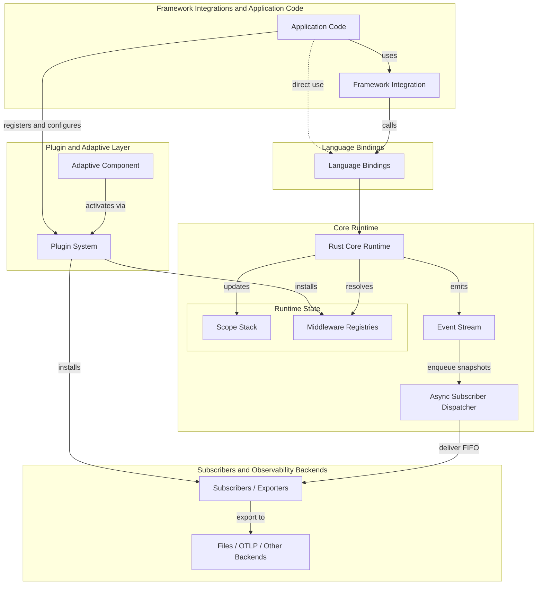

import { MermaidStyles } from "@/components/MermaidStyles";

{/* SPDX-FileCopyrightText: Copyright (c) 2026, NVIDIA CORPORATION & AFFILIATES. All rights reserved.
SPDX-License-Identifier: Apache-2.0 */}

This page explains how NeMo Relay connects scopes, middleware, plugins, events,
subscribers, and exporters.

## Architecture Diagram

This diagram connects the runtime pieces to the layers they inhabit.

<MermaidStyles />

Adaptive appears here as a built-in plugin component rather than a separate runtime model because it activates through the same plugin lifecycle.

## Runtime Model

NeMo Relay combines a small number of runtime pieces into one shared execution model:

- The **scope stack** answers where work belongs
- The **middleware registries** answer what should happen around that work
- The **plugin system** installs reusable runtime behavior from configuration
- The **event stream** records what happened
- The **async subscriber dispatcher** delivers event snapshots after emission
- **subscribers** consume those events

Every emitted scope, tool, LLM, or mark event attaches to the active scope stack. Every managed tool or LLM call resolves the currently visible middleware before it executes.

## Main Runtime Pieces

These components are the primary building blocks that make up the runtime model.

### Scope Stack

The active scope stack defines the ownership tree for runtime work. It establishes:

- Parent-child relationships between events
- Scope-local visibility for middleware and subscribers
- Cleanup boundaries for scope-owned registrations
- Isolation across concurrent requests or workers

### Middleware Registries

The middleware registries hold the active intercepts and guardrails for tool and LLM execution. Managed helpers read those registries before invoking the real callback.

### Plugin System

The plugin system installs reusable runtime components from configuration. A plugin can register middleware, subscribers, or related behavior without requiring each application call site to do the work manually.

### Event Emission

The runtime emits structured events for scopes, tools, LLMs, and named marks. Those events are the canonical record of runtime behavior. Native Rust, Python, Node.js, and FFI event-producing APIs enqueue subscriber work and return without waiting for subscriber callbacks or exporter work.

### Subscribers and Exporters

Subscribers consume the event stream through the background dispatcher. Some subscribers stay in-process. Others export that stream into files or tracing systems. Use the binding flush API when a test or shutdown path must wait for already-queued subscriber work.

## Two Axes of Runtime State

Runtime state is easiest to understand by separating ownership from process-wide
registration.

### Scope Ownership

The scope stack defines:

- Where work belongs
- Which scope-local behavior is visible
- When scope-local registrations are cleaned up
- Whether concurrent requests stay isolated

### Middleware Ownership

Middleware exists at two levels:

- **global registrations** stay active process-wide until removed
- **scope-local registrations** are owned by one scope and disappear when that scope closes

That split lets long-lived defaults coexist with request-specific or task-specific behavior.

## Managed Execution Pipeline

Managed tool and LLM execution follows the same high-level order:

1. Conditional-execution guardrails decide whether work can proceed.
2. Request intercepts can rewrite the real request.
3. Sanitize-request guardrails can rewrite the emitted start-event payload.
4. Execution intercepts wrap or replace the user callback.
5. The user callback runs.
6. Sanitize-response guardrails can rewrite the emitted end-event payload.

Two distinctions matter:

- Intercepts affect the real execution path
- Sanitize guardrails affect the emitted observability payload

For the expanded request-to-response runtime path, including streaming and subscriber handoff, see [Middleware](/about-nemo-relay/concepts/middleware#detailed-execution-flow).

## Runtime Layers

From bottom to top, NeMo Relay is organized as:

1. The Rust core runtime
2. The plugin and adaptive layer
3. Language bindings
4. Framework integrations and application code
5. Subscribers and observability backends

The details of a binding can vary, but the conceptual model stays the same across those layers.

## Design Goal

NeMo Relay is designed so that application developers, framework integrators, plugin authors, and observability consumers all reason about the same runtime semantics. One conceptual model should remain stable even when the binding or integration style changes.

## Related Concepts

The following concepts are related to this architecture:

- [Scopes](/about-nemo-relay/concepts/scopes)
- [Middleware](/about-nemo-relay/concepts/middleware)
- [Events](/about-nemo-relay/concepts/events)
- [Subscribers](/about-nemo-relay/concepts/subscribers)
- [Plugins](/about-nemo-relay/concepts/plugins)
