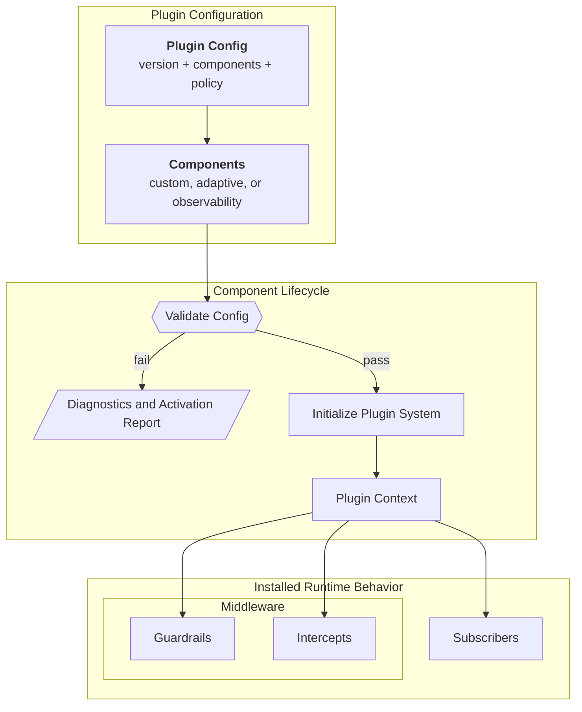

import { MermaidStyles } from "@/components/MermaidStyles";

{/* SPDX-FileCopyrightText: Copyright (c) 2026, NVIDIA CORPORATION & AFFILIATES. All rights reserved.
SPDX-License-Identifier: Apache-2.0 */}

This page explains how plugins package reusable runtime behavior behind configuration.

## Why Plugins Exist

Plugins let NeMo Relay install reusable runtime behavior from configuration
instead of requiring every application or framework integration to register the
same middleware and subscribers by hand.

They are the main packaging layer for reusable runtime components.

## Plugin Configuration Model

The canonical plugin document has three main areas:

- `version`
- `components`
- `policy`

### Version

The version identifies the configuration format expected by the plugin system.

### Components

Components describe the individual runtime pieces to activate. Each component
declares what it is and which config it should use.

### Policy

Policy controls how strictly the plugin system interprets unknown fields,
unsupported values, or compatibility issues.

## Component Lifecycle

Plugins follow a small lifecycle rather than registering everything blindly.

### Validation

Validation checks whether the supplied config is structurally and semantically
acceptable before initialization.

### Initialization

Initialization activates the configured components and registers their runtime
behavior.

### Activation Reporting

Reporting provides structured diagnostics about what activated successfully and
what did not.

<MermaidStyles />

## Plugin Context

The plugin context is the runtime surface that a component uses to register its
behavior. This is where plugins connect configuration to real runtime state.

## What Plugins Can Register

Depending on the component, a plugin can register:

- Middleware
- Subscribers
- Related runtime helpers

This is what makes plugins a packaging mechanism rather than a separate runtime
model. Plugins do not replace scopes, middleware, or subscribers. They install
them.

## Ownership and Scope

Plugin initialization is process-level. It is intended for runtime components
that should activate once for the running process rather than once per request.

Scope-local behavior still matters after plugin installation, but the plugin
system itself is a global activation layer.

## Built-In Plugin Examples

Core plugin APIs register built-in components before lookup, validation, and
initialization. Applications can still register custom plugins, but first-party
components are available by kind without an explicit registration call.

### Adaptive

Adaptive is implemented as a built-in plugin component. It is not a separate
runtime model. It uses the same plugin system as custom components.

This matters conceptually because adaptive behavior is configured and activated
through the same component lifecycle as other plugins:

- Validate the config
- Initialize the plugin system
- Inspect the activation result if needed

Detailed adaptive configuration belongs in
[Adaptive Configuration](/adaptive-plugin/configuration),
[Adaptive Cache Governor (ACG)](/adaptive-plugin/acg), and
[Adaptive Hints](/adaptive-plugin/adaptive-hints).

### Observability

The core crate ships a built-in `observability` plugin component for Agent
Trajectory Observability Format (ATOF), Agent Trajectory Interchange Format
(ATIF), OpenTelemetry, and OpenInference exporters. Each exporter section is
disabled unless its section sets `enabled: true`, and subscriber names are
inferred from the plugin namespace instead of exposed in public config.

Detailed observability plugin configuration belongs in
[Observability Configuration](/observability-plugin/configuration).

### NeMo Guardrails

The core crate also ships a built-in `nemo_guardrails` plugin component. It is
the first-party Guardrails integration point that NeMo Relay owns through the
shared plugin system.

The current shipped user-facing lane is the remote backend. It gives NeMo Relay
one canonical plugin kind and config shape for Guardrails-backed managed LLM
and tool checks while broader backend parity work remains separate.

Detailed Guardrails plugin configuration belongs in
[NeMo Guardrails Configuration](/nemo-guardrails-plugin/configuration).

For the CLI gateway's `plugins.toml` discovery, precedence, merge, and editing
rules, see [Plugin Configuration Files](/build-plugins/plugin-configuration-files).

## Practical Guidance

Use these practices when applying the concept in application or integration code.

- Use plugins when behavior should be reusable across applications or
  integrations.
- Validate plugin config before initialization.
- Treat plugins as the configuration-driven installation path for runtime
  behavior.
- Keep detailed field-by-field config questions in the relevant guide for that plugin component.
