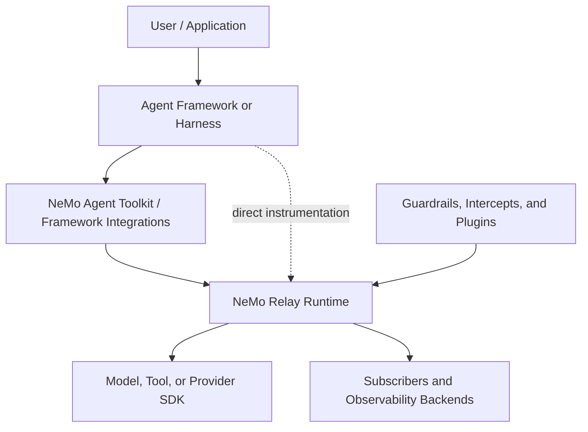

import { MermaidStyles } from "@/components/MermaidStyles";

{/* SPDX-FileCopyrightText: Copyright (c) 2026, NVIDIA CORPORATION & AFFILIATES. All rights reserved.
SPDX-License-Identifier: Apache-2.0 */}

NeMo Relay is the agent execution runtime layer in the NVIDIA NeMo ecosystem. It
does not replace an agent framework, model provider, guardrail authoring system,
or deployment platform. Instead, it gives those systems one shared way to model
execution scopes, lifecycle events, middleware, plugins, adaptive behavior, and
observability around tool and LLM calls.

Use this page to understand where NeMo Relay fits:

- Inside the NVIDIA NeMo software stack
- Inside agent frameworks, harnesses, and provider adapters
- Across the Rust, Python, Node.js, Go, and C FFI surfaces in this
  repository

## How NeMo Relay Fits In The NVIDIA NeMo Ecosystem

The NVIDIA NeMo ecosystem spans model development, agent construction,
guardrailing, inference, optimization, and runtime operations. NeMo Relay has a
narrower responsibility: it is the portable execution substrate that agent
systems can call when actual work crosses a scope, tool, or model boundary.

| Layer | Typical Responsibility | NeMo Relay Relationship |
|---|---|---|
| NeMo model, inference, and deployment components | Provide or serve the models an agent uses. | NeMo Relay records and controls LLM execution boundaries, but it does not train, host, or route model inference by itself. |
| NeMo Agent Toolkit and agent application frameworks | Build, run, profile, and optimize agent workflows across tools, data sources, and framework choices. | NeMo Relay can sit below these systems as the shared runtime contract for scopes, middleware, lifecycle events, subscribers, and plugins. |
| NeMo Guardrails and policy systems | Define safety, control, and compliance behavior for LLM applications. | NeMo Relay can host runtime guardrails and intercepts around managed tool and LLM calls, while higher-level guardrail systems can still own policy authoring and orchestration. |
| Application harnesses and workflow code | Decide the agent pattern, planner, memory, retries, scheduling, and user-facing behavior. | NeMo Relay instruments the execution boundaries that the harness already owns. |
| Observability and evaluation backends | Store traces, trajectories, metrics, and analysis data. | NeMo Relay emits lifecycle events and exports them to in-process subscribers, Agent Trajectory Observability Format (ATOF), Agent Trajectory Interchange Format (ATIF), OpenTelemetry, OpenInference-compatible traces, or other backends. |

In practical terms, NeMo Relay answers a different question than higher-level
agent products. A framework asks, "What should the agent do next?" NeMo Relay
asks, "When the agent does work, which scope owns it, which middleware applies,
what events are emitted, and which subscribers can consume the result?"

<MermaidStyles />

The dotted path matters. An application or custom harness can call NeMo Relay
directly without adopting a higher-level framework. A framework integration can
also call NeMo Relay on behalf of application code when the framework owns the
tool or provider boundary.

## How NeMo Relay Fits Agent Frameworks And Harnesses

The agent framework and harness landscape is intentionally mixed. A team might
use NeMo Agent Toolkit, LangChain, LangGraph, an internal orchestration layer, a
provider SDK, or direct application code. NeMo Relay is designed to meet those
systems at stable execution boundaries instead of requiring one framework shape.

| Integration Point | Use NeMo Relay For | Keep In The Framework Or Harness |
|---|---|---|
| Request, run, workflow, or agent lifecycle hooks | Create scopes, emit scope start and end events, and isolate concurrent work. | Scheduling, routing, retry policy, planner choice, memory, and user session state. |
| Tool invocation callbacks | Run managed tool execution, apply tool middleware, emit tool lifecycle events, and preserve parent scope context. | Tool discovery, tool schema presentation, framework-specific callback signatures, and application-visible result handling. |
| LLM or provider adapter calls | Run managed LLM execution, attach model metadata, apply LLM middleware, handle stream lifecycle events, and emit normalized observability payloads. | Provider clients, authentication, transport, provider-native request objects, and provider-specific response types. |
| Framework internals that cannot hand over a callback | Use explicit lifecycle APIs, request-intercept helpers, guardrail helpers, or mark events. | The actual invocation path when the framework must retain control. |
| Cross-cutting behavior | Package middleware, subscribers, adaptive behavior, and reusable policy as plugins. | Framework configuration, agent definitions, deployment topology, and business logic. |

Prefer a managed execution wrapper when a framework exposes a stable callback
that NeMo Relay can own. Use explicit lifecycle calls or standalone helpers when
the framework owns the callback internally but exposes reliable start, finish, or
request transformation hooks.

This lets NeMo Relay provide consistent runtime semantics without forcing a
framework migration:

- Applications keep their existing agent orchestration model
- Framework adapters preserve public behavior and callback signatures
- Non-serializable provider objects stay in framework-owned storage
- NeMo Relay receives JSON-compatible payloads for middleware and events
- Subscribers see a consistent scope, tool, and LLM event stream across integrations

## Related Topics

Use these links to continue into adjacent concepts and workflows.

- [NVIDIA NeMo documentation](https://docs.nvidia.com/nemo/index.html)
- [NVIDIA NeMo Agent Toolkit documentation](https://docs.nvidia.com/nemo/agent-toolkit/latest/)
- [NVIDIA NeMo Guardrails documentation](https://docs.nvidia.com/nemo-guardrails/index.html)
- [Integrate into Frameworks](/integrate-into-frameworks/about)
- [Adding Framework Scopes](/integrate-into-frameworks/adding-scopes)
- [Wrapping Tool Calls](/integrate-into-frameworks/wrap-tool-calls)
- [Wrapping LLM Calls](/integrate-into-frameworks/wrap-llm-calls)
- [Plugin Model](/build-plugins/basic-guide)
