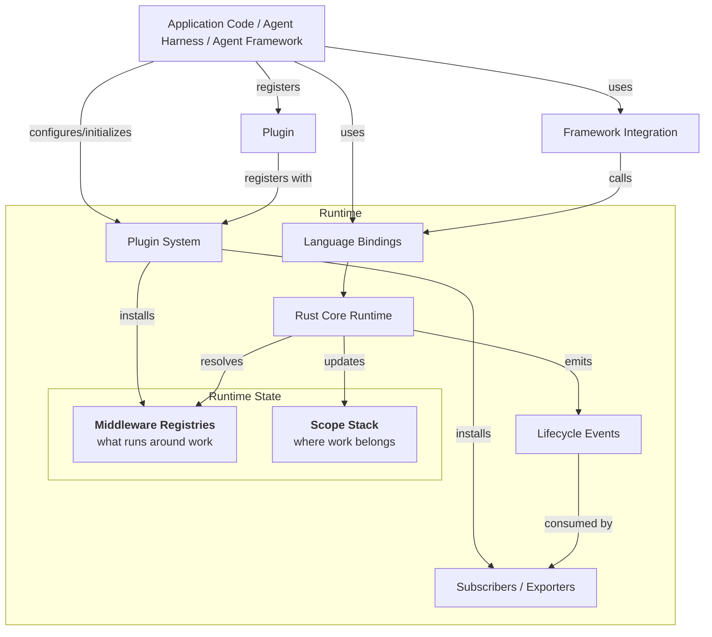

import { MermaidStyles } from "@/components/MermaidStyles";

{/* SPDX-FileCopyrightText: Copyright (c) 2026, NVIDIA CORPORATION & AFFILIATES. All rights reserved.
SPDX-License-Identifier: Apache-2.0 */}

NVIDIA NeMo Relay helps you observe and control what happens inside agent runs
without rewriting the agent stack you already have. It gives coding agents,
applications, framework integrations, middleware, and observability backends a
shared runtime for scopes, policy, plugins, and lifecycle events.

Agent systems usually cross several boundaries in one request: an entrypoint
starts work, a model is called, tools run, subagents may branch off, and
observability or policy systems need to understand what happened. Relay gives
those boundaries one runtime contract instead of asking each layer to invent its
own wrappers, trace vocabulary, and cleanup rules.

## Integrating With Relay

Relay sits around the work you want to observe or control. Work can be a local
coding-agent session, a request, a turn, an LLM call, a tool call, a subagent
run, or a framework-specific lifecycle unit.

<Note>
Relay does not replace your agent framework, model provider, application logic,
observability backend, or guardrail authoring system. It gives those systems a
common runtime boundary to meet at.
</Note>

The first design question is simple: where can Relay observe or control the real
work? The answer determines whether you should use a CLI sidecar, direct SDK
instrumentation, a maintained integration, a framework wrapper, or a plugin.

## Choose Your First Path

Pick the row closest to what you are trying to do.

| Goal | Start With | Why |
|---|---|---|
| Observe Codex, Claude Code, or Hermes locally | [NeMo Relay CLI](/nemo-relay-cli/about) and [Basic Usage](/nemo-relay-cli/basic-usage) | Relay runs as a local sidecar, forwards hooks, routes provider traffic when configured, and writes observability artifacts without changing application code. |
| Run the smallest binding-specific example | [Quick Start](/getting-started/quick-start) | Use this when you want a minimal Rust, Python, or Node.js workflow before adding Relay to real application code. |
| Instrument application-owned LLM or tool calls | [Instrument Applications](/instrument-applications/about) | Direct SDK instrumentation gives Relay full managed-call semantics around callbacks your code owns. |
| Use LangChain, LangGraph, Deep Agents, or OpenClaw | [Supported Integrations](/supported-integrations/about) | Maintained integrations use public framework or plugin APIs where they preserve enough lifecycle fidelity. |
| Build a framework, host, or provider integration | [Integrate into Frameworks](/integrate-into-frameworks/about) | Integration guidance helps you choose managed wrappers, explicit lifecycle APIs, hook replay, provider codecs, or upstream support. |
| Package reusable exporters, middleware, or policy | [Build Plugins](/build-plugins/about), [Observability](/observability-plugin/about), and [NeMo Guardrails Plugin](/nemo-guardrails-plugin/about) | Plugins are the configuration-driven path for behavior that should be shared across applications or teams. |
| Develop or validate the repository itself | [Development Setup](/contribute/development-setup) and [Testing and Docs](/contribute/testing-and-docs) | Use the contributor workflow when you are changing Relay source, docs, examples, bindings, or integrations. |

<Note>
If you are unsure how much Relay you need, capture one boundary first. Confirm
that Relay emits raw lifecycle events, then add normalized exports, middleware,
guardrails, or adaptive behavior.
</Note>

## Validate Raw Capture First

Start with [Agent Trajectory Observability Format (ATOF) JSONL](/observability-plugin/atof),
the raw canonical event stream. It shows the lifecycle events Relay actually
captured before anything is translated into
[Agent Trajectory Interchange Format (ATIF)](/observability-plugin/atif),
OpenTelemetry, or OpenInference output.

A good first integration process workflow is as follows:

1. Create or identify one scope boundary.
2. Capture one LLM, tool, session, or turn boundary.
3. Export ATOF JSONL and inspect the raw event stream.
4. Add ATIF, OpenTelemetry, or OpenInference when the raw events are trustworthy.
5. Add middleware only when Relay must block, sanitize, rewrite, route, or
   replace real execution.

## Key Features

NeMo Relay offers the following features when you use it with your agent stacks:

- **Scopes** so runs, turns, tools, LLM calls, and subagents have clear
  ownership, parent-child lineage, cleanup boundaries, and request isolation.
- **Managed LLM and tool calls** so the same lifecycle and middleware rules
  apply around each callback.
- **Middleware** for the places where Relay must block, sanitize, transform,
  route, retry, or replace execution.
- **Plugins** so reusable observability, guardrail, adaptive, and exporter
  behavior can be turned on from configuration.
- **Events and subscribers** so raw ATOF, normalized ATIF, OpenTelemetry, and
  OpenInference output all come from the same runtime stream.

Use [Concepts](/about-nemo-relay/concepts) when you want the deeper model for
scopes, events, middleware, subscribers, and plugins.

## Developer Background

Rust is the source of truth for runtime behavior. The Python and Node.js
bindings expose the same core model for primary application use. Go and raw C
FFI are experimental and source-first surfaces.

Developers building integrations should start by identifying who owns the real
LLM or tool call. If Relay can wrap the real callback, use managed execution. If
the framework exposes lifecycle hooks but not execution control, use explicit
lifecycle APIs or hook replay. If provider-shaped payload capture matters,
consider the gateway/provider path and treat it as production traffic.

<Warning>
Do not add behavior to one primary binding without checking Rust, Python, and
Node.js parity. Public behavior should stay consistent across the supported
runtime surfaces.
</Warning>

## Documentation

Use the tasks below to build your understanding and set up Relay:

| Task | Start With |
|---|---|
| Install packages | [Installation](/getting-started/installation) |
| Understand the mental model | [Agent Runtime Primer](/getting-started/agent-runtime-primer) |
| Configure plugin files | [Plugin Configuration Files](/build-plugins/plugin-configuration-files) |
| Export traces or trajectories | [Observability](/observability-plugin/about) |
| Tune performance with adaptive behavior | [Adaptive](/adaptive-plugin/about) |
| Debug trace incidents | [Trace Incident Runbook](/resources/troubleshooting/trace-incident-runbook) |
| Look up symbols | [APIs](/reference/api) |

## Conceptual Diagram

The diagram below shows how applications, runtime components, and exporters
relate to each other. Scopes define where work belongs, middleware registries
define what runs around that work, and subscribers consume the lifecycle events
that the core emits.

<MermaidStyles />

